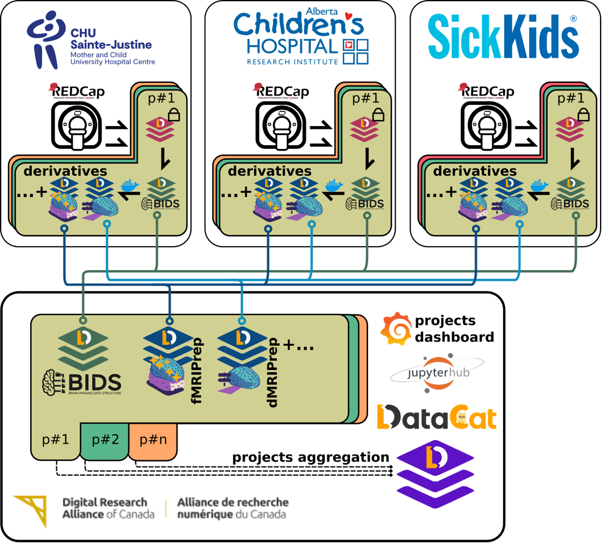
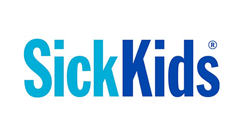

BIDS-flux: A Scalable FAIR Data Management Platform Tailored for Neuroimaging Research
=====

Welcome to the documentation for the BIDS-flux neuroinformatics platform. This documentation provides an in-depth guide to the deployment, functionality, and usage of the infraestructure.

About
-----

In the age of data-driven research, managing large-scale, high-quality datasets is essential but remains complex and resource-intensive. Scientific data collection, curation, and sharing often follow sequential phases, limiting real-time observability and operational improvements. Adhering to FAIR principles (Findability, Accessibility, Interoperability, and Reusability) is crucial, alongside ethical and security considerations, especially for human research data.

To address these challenges, we have developed a scalable FAIR data management platform tailored for neuroimaging research. Built on BIDS standards and Datalad, this platform integrates GitLab for workflow orchestration and MinIO for object storage. It enables continuous data ingestion from multiple sources (MRI, RedCap, Biopac), standardization (heudiconv, phys2bids), anonymization, quality control (MRIQC), and reproducible processing with BIDSApps.

Leveraging Git decentralization and federated dataset management, our platform allows multiple sites to contribute data independently while ensuring robust version control and long-term archival (e.g., DataVerse). Given the vulnerabilities of centralized digital infrastructures, this distributed approach enhances research resilience.

Beyond automation, our goal is to make data access and analysis intuitive for researchers. We plan to integrate BinderHub-powered environments to support interactive exploration and executable, reproducible preprints (e.g., NeuroLibre), ensuring full provenance tracking from data collection to publication.

While initially designed for neuroimaging, this modular infrastructure can be adapted to other scientific domains, provided compatible data standards and reproducible tools.

Principles
----------

The **BIDS-flux** infrastructure is built around **FAIR principles** to ensure that research data is well-organized, shareable, and reproducible.

Findable
^^^^^^^^

- All datasets are structured using the **BIDS standard**, ensuring consistent metadata and organization.
- Persistent identifiers (e.g., DOIs, dataset UUIDs) allow datasets to be easily referenced and discovered.
- Comprehensive metadata indexing enables efficient search and retrieval within repositories.

Accessible
^^^^^^^^^^

- Data is stored in a **GitLab-hosted Datalad repository**, enabling controlled access via standard authentication mechanisms.
- Object storage (**MinIO**) ensures scalable and secure access to raw and processed datasets.
- Researchers can retrieve datasets through command-line tools, APIs, or web interfaces while maintaining security and ethical compliance.

Interoperable
^^^^^^^^^^^^^

- Data follows the **BIDS standard**, ensuring compatibility with a wide range of neuroimaging and scientific tools.
- Standardized formats (e.g., **NIfTI for MRI, JSON for metadata**) enable seamless integration with automated workflows.
- The use of **Datalad and Git-annex** allows interoperability across different storage systems and computing environments.

Reusable
^^^^^^^^

- **Datalad provenance tracking** ensures every dataset version and modification is documented, enabling reproducibility and re-usability.
- Containerized processing workflows (**BIDSApps**) ensure consistency across different computational environments.

.. note::

   This documentation is a work in progress, and we are continuously updating and expanding it to provide you with the most comprehensive and helpful information. Thank you for your patience.

If you have any questions or need assistance, feel free to [link to contact information or support].

