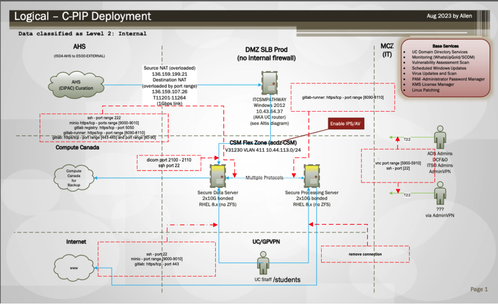

Montreal Virtual Machine Configuration
=====================================

.. .. figure:: ../../_static/infographics/Visio-C-PIP Deployment - Logical - v1.0.pdf
..    :name: fig-deployment-logical

   Logical Deployment Diagram

In the figure above, you can see the logical deployment diagram proposed by the Calgary IT. The Montreal and Toronto sites may differ in many of these details, but the :ref:`diagram <diagram>` pertaining to the two servers (the connectivity, user access, Compute Canada) should be very similar.

Server Configuration
--------------------

1. **Server Model:** Dell PowerEdge R750.

2. **Virtual Machine Image or ISO:** Ubuntu 18.04, 20.04, 22.04 (preferred, see install link for other viable options).

3. **Hypervisor Compatibility:** Ensure that the VM image is compatible with the hypervisor software that will be used to run it (e.g., VMware, VirtualBox, Hyper-V, KVM).

4. **VM Hardware Configuration:**

   a. **CPU and RAM Allocation:** 2 x Intel® Xeon® Gold processors with 8 cores each, resulting in a total of 32 cores (equivalent to 128 vCPUs for virtualization). 12 x 16GB RAM modules per server, providing a total of 192GB RAM for each server (384GB in total).

   b. **Storage:** Each server is equipped with 2 M.2 SSDs, 480GB each, configured in RAID 1. This RAID 1 setup is intended for the server's operating system and VM storage needs.

   c. **Network Configuration:** Setting up the self-hosted Gitlab instance involves creating SSH keys, for example.

   d. **Disk Configuration:** Define virtual hard disk size, type (e.g., VMDK, VHD). Storage location is the storage server.

5. **Operating System Installation:** If the VM doesn't include an operating system, provide instructions or scripts for installing the OS from a standard image or ISO file.

6. **Software and Application Configuration:** Ensure that all required software and applications are pre-installed and properly configured within the VM. Document any software licenses or keys.

   - ZFS File System Server (see notes): A robust ZFS file system server is required for efficient data management and storage.
   - Ubuntu: The stable and widely recognized Ubuntu Linux distribution is recommended as the operating system for hosting Gitlab.
   - Git, Gitlab, Git-annex, gitlab-runner
   - Docker Compatibility: Ensuring compatibility with containerized software frameworks like Docker is essential for seamless deployment and management of Gitlab within a containerized environment (Example images used: DataLad, Heudiconv).
   - Apptainer (Singularity).

7. **User Accounts and Permissions:**

   a. Full control over setting up user accounts and groups within the VM.
   b. Define user roles and permissions to ensure proper access control.
   c. Document login credentials or SSH keys for user access.

8. **Security Configuration (for local IT):**

   a. Configure firewall settings and security policies.
   b. Apply necessary security patches and updates.
   c. Set up antivirus and intrusion detection software, if applicable.

9. **Network Configuration:**

   a. Document IP addresses.
   b. Ensure that network ports required for the VM's services or applications are open and properly configured.

10. **Hostname and DNS Configuration:** Set a meaningful hostname for the VM and configure DNS resolution if needed.

11. **Scripts and Automation:** If any post-deployment scripts or automation are required to set up the VM, provide these scripts along with instructions for their execution.

12. **Networking Considerations:** The VMs need to communicate with other systems. Does it need an assigned static IP address or DNS name? Document any required network configurations, such as routing or port forwarding.

13. **Backup and Restore Procedures:** Document backup and restore procedures to ensure data integrity and recovery options.

   Data is backed up on the storage server, and certain datasets will be shared and backed up on Digital Alliance clusters.

14. **File Sharing and Permissions:** If the VM includes shared files or folders, configure file sharing and set appropriate permissions for access.

Notes
-----

- ZFS is a bonus. It helps with the daily backups on Compute Canada. It's because its journaling feature lets us easily index changes. However, we could easily work around.
- The number of CPUs and memory is based on the type of pipelines and the volume of data we're planning to generate every week.
- There is no need for storage on the Compute server. The plan was to mount space from the storage server.
- If it works standalone, there's no need for 100 TB! 10 TB is plenty.
- The original ZFS solution was meant to scale for the needs of imaging researchers, beyond the data they acquire themselves. This would host samples like HCP, UK Biobank, etc. This will take several PB over time.
- The ZFS solution was meant to scale over time, funded through user fees. If we scrap that system, Vincent and Élodie need to have a credible and cheap alternative.
- With the proposed solution, costs would have been roughly 10k for 50 TB. This is with redundant and resilient local storage and two copies offsite constantly being maintained. So roughly 300 TB of actual orchestrated storage, adhering to best practices for long-term data maintenance.
- These numbers are very approximate, by the way. This will depend on actual up-to-date quotes and likely be cheaper than what I list here in practice.
- Also, ideally, the Compute server and storage would be connected at 10 Gb/second.

Calgary Servers Configuration
=============================

.. .. figure:: ../../_static/infographics/Visio-C-PIP Deployment - Logical - v1.0.pdf
..    :name: fig-deployment-logical

.. _diagram:

   Logical Deployment Diagram

In the figure above, you can see the logical deployment diagram proposed by the Calgary IT. The Montreal and Toronto sites may differ in many of these details, but the diagram pertaining to the two servers (the connectivity, user access, Compute Canada) should be very similar.

Server Configuration
--------------------

For Calgary, the development will be performed on two bare-metal servers running RHEL 8.x with no ZFS. The secure data server and the secure processing server:

#. **Server Model:**

   a. Secure data server: Dell PowerEdge R760XD2

   b. Secure processing server: Dell PowerEdge R7525

#. **ISO:** RedHat 8.x Calgary specific.

#. **Hardware Configuration:**

   #. **CPU and RAM Allocation:**

      a. Secure data server: 2x 4410Y 12 Cores, 16x 16G RAM (256 GB total)

      b. Secure processing server: 2x 7453 56 Cores 16x 32G RAM (512 GB total)

   #. **Storage:**

      a. Secure data server: 12x 16TB NLSAS

      b. 2x 800GB 3DWPD, 2x 3.2TB NVME 3DWPD

      c. Network Configuration: Can be better seen in the :ref:`diagram <diagram>`.

      d. Disk Configuration: 
   
   #. **Software and Application Configuration:**

      a. RedHat 8.x was a requirement from the University of Calgary, which does not allow us to use ZFS.

      b. Required software includes docker, Git, Datalad, Git-annex, self-hosted gitlab, gitlab runner, self-hosted MinIO.

   #. **User Account and Permissions:** Will be linked to the University of Calgary's active directory.

   #. **Security Configuration:** Firewall configuration can be seen in the :ref:`diagram <diagram>`.

